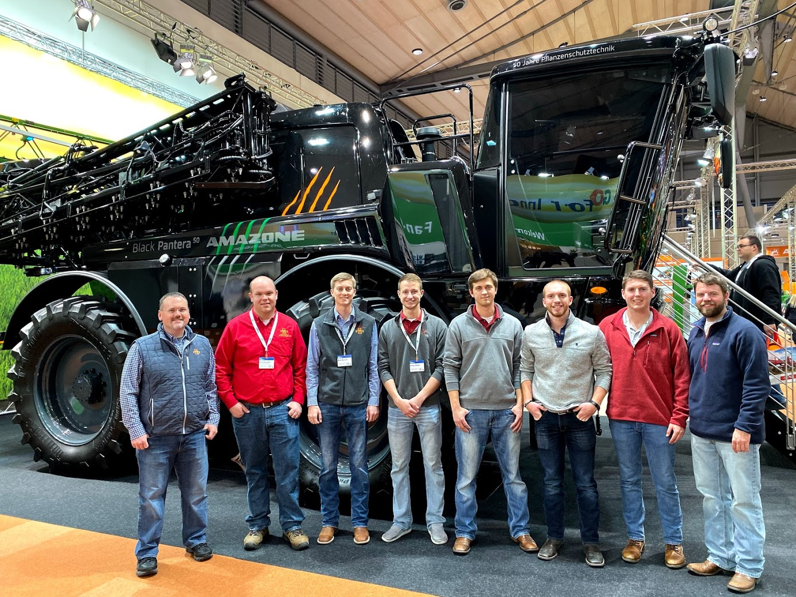
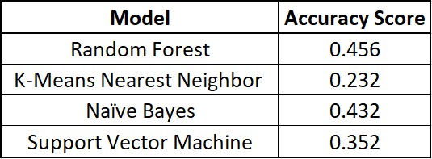

## Creator Introduction

  
   
Hello everyone! My name is Kyle Blaylock and I am a graduate student at Iowa State University. I am currently working on a Master's of Science degree in Agricultural Engineering with an emphasis in Advanced Machinery Systems. More specifically, self-propelled agricultural sprayers and how their performance can be improved. I took ABE 516X because my research is very data heavy and I wanted to learn new and different ways to handle large amounts of data.
   

    

## Project & Website Description
  
The goal of this website / project is to be able to take an uploaded image from the site user and classify it into one of the following animal groups:

  - *Mammals*
  - *Birds*
  - *Fish*
  - *Reptiles*
  - *Amphibians*
  
To accomplish this, several machine learning models will be trained with collected image data and evaluated based on their accuracy.
The most accurate model will be chosen and used to evaluate the user input image on this website.

## Project Workflow

  

## Data Collection

Data was collected by doing a Google Image search for each of the animal groups and then saving images of each group into a local folder. During collection I did my best to only include images that were of the animals in their natural habitat (e.g. no images with white or black baackgrounds, human hands in the picture etc.) These images were then referenced into an Excel spread sheet which classified which group that image belonged to.

## Data Modeling 
  
Raw image data was extracted using a function I created that used the Python PIL Image functions to import and split the images. The images were split into red, green and blue bands and then the average and standard deviation was taken from those bands. These metrics for each image were written to a Pandas Data frame along with the label for each image. I also attempted to use a second method which utlized TensorFlow and Keras to split each individual pixel of the image into these fields. I was able to sucessfully extract the data from the images with this method but wasn't able to train a model it required more computing power than my laptop is capable of.

## Machine Learning

With the extracted RGB data from each of the images I trained four seperate models. The models I trained used four different methods of classification: Random Forest, K-Means Nearest Neighbor, Naive Bayes, and Support Vector Machine. Each model was trained with 875 samples and tested on 125 samples. Each model was tuned with the given parameters from the Scikit learn package. The results of these models is below in the verification and accuracy section.

## Model Verification & Accuracy

    

### - Random Forest Classifier

### - K-Means Nearest Neighbor

### - Naive Bayes

### - Support Vector Machine

## Model Testing

Show 4 images and what they were classified as.

## What To Do Moving Forward

Different techniques of classification.
Image editing (background removal, outlining, etc).

## Class Task

Create a task that could be completed by future students.

## References & Documentation

Attach any links used or references.
