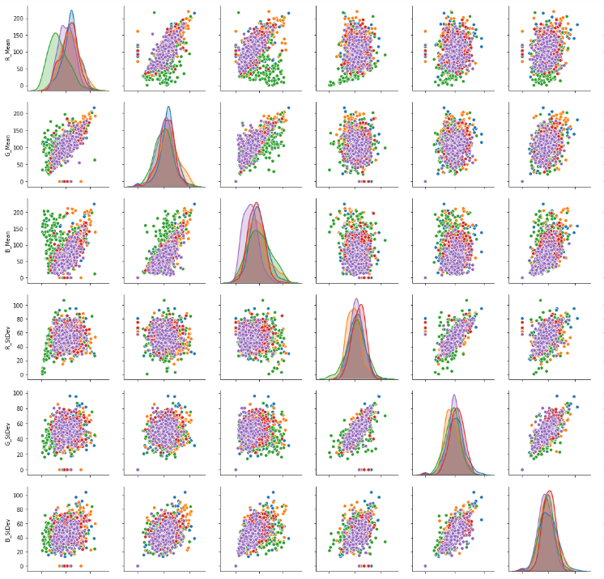

## Creator Introduction
   
Hello everyone! My name is Kyle Blaylock and I am a graduate student at Iowa State University. I am currently working on a Master's of Science degree in Agricultural Engineering with an emphasis in Advanced Machinery Systems. More specifically, self-propelled agricultural sprayers and how their performance can be improved. I took ABE 516X because my research is very data-heavy and I wanted to learn new and different ways to handle large amounts of data.

    

## Project & Website Description
  
The goal of this website / project is to be able to take an image or images and classify it into one of the following animal groups:

  - *Mammals*
  - *Birds*
  - *Fish*
  - *Reptiles*
  - *Amphibians*
  
To accomplish this, several machine learning models will be trained with collected image data and evaluated based on their accuracy.
The most accurate model will be chosen and used to evaluate other images.

## Project Workflow

  

## Data Collection
 
Data was collected by doing a Google Image search for each of the animal groups and then saving images of each group into a local folder. During data collection, I did my best to only include images that were of the animals in their natural habitat (e.g. no images with white or black backgrounds, human hands in the picture, etc.) These images were then referenced into an Excel spreadsheet which classified which group that image belonged to.

## Data Modeling 
  
Raw image data were extracted using a function I created that used the Python PIL Image functions to import and split the images. The images were split into red, green and blue bands and then the average and standard deviation were taken from those bands. These metrics for each image were written to a Pandas Data frame along with the label for each image. I also attempted to use a second method which utilized TensorFlow and Keras to split each individual pixel of the image into these fields. I was able to successfully extract the data from the images with this method but wasn't able to train a model it required more computing power than my laptop is capable of.

## Machine Learning

With the extracted RGB data from each of the images, I trained four separate models. The models I trained used four different methods of classification: Random Forest, K-Means Nearest Neighbor, Naive Bayes, and Support Vector Machine. Each model was trained with 875 samples and tested on 125 samples. Each model was tuned with the given parameters from the Scikit learn package. The results of these models are below in the verification and accuracy section.

## Model Verification & Accuracy

    

#### - Random Forest

This was the most accurate model that I was able to create for the project. It still isn't very accurate as it only correctly predicted about 45% of the test set data. I believe this was the best model of the four that I tested because It allows for many different classification branches rather than just five buckets for classes. 

#### - K-Means Nearest Neighbor

This was the least accurate model used for the project. After looking at some plots of the data it makes sense why this was the least accurate and why these models were pretty inaccurate overall. This is discussed more in the "What To Do Moving Forward" section.

#### - Naive Bayes

This model was almost as accurate as the Random Forest model. I think this can be attributed to the fact that Naive Bayes is based on probability not just the raw values of the input data to the model.

#### - Support Vector Machine

This model had similar results to the K-Means model. Again this will be discussed more in the "What To Do Moving Forward" section.

## Model Testing

Just for fun, I decided to put a few images of my colleagues and myself into the Random Forest model, as it was the most accurate, and see what we would be classified as. Our images and classifications can be found below. 

        

      

  
Adams = Reptile   |    Blaylock = Fish   |   Deutsch = Mammal   |   Irlbeck = Reptile   |   Rewerts = Mammal

## What To Do Moving Forward

As I worked on this project and did some research on the task of image classification and analysis, I found numerous methods to break down, sort, and classify images. As stated previously, I broke each image down into its RGB values and used those to classify the images. Some other methods include:

   - Image Outlining
   - Image Background Removal
   - Pixel By Pixel Image Analysis

I think doing some of these things would help tremendously as after looking at some comparison plots of the RGB data, there weren't many groupings that occurred with the classes. All of the RGB data just piles on top of each other. So my data collection methods seemed to be too simple to be able to accurately classify animal class. This can be seen in the image below.

    

Also picking images of a specific animal or other specific images would help as well. For example, trying to classify a goldfish vs a cat. I think that there was too much variation in my data, which led to low accuracy in my models.

## Class Task

For a class task, I would suggest using the tutorial that I created for the animal images classification using Keras and TensorFlow. It is in the "Code" folder of this repo and is called "Keras_Model_Evaluation_Script.ipynb". I think that this would be a good task that could also be done alongside the Amazon Workspace portion of this course as my computer didn't have enough ponies to even train the model of this type. It would be interesting to see if this method is any more effective than the RGB method that I used. All of the images I used for this project can be found in the "Animal_Images" folder of this repo.

## References

- [Google Images Search](https://www.google.com/imghp?hl=en&tab=ri&authuser=0&ogbl)
- [Image Classification Model](https://www.analyticsvidhya.com/blog/2019/01/build-image-classification-model-10-minutes/)
- [Python Machine Learning](https://www.pyimagesearch.com/2019/01/14/machine-learning-in-python/)
- [Image Data Extraction Techiniques](https://www.analyticsvidhya.com/blog/2019/08/3-techniques-extract-features-from-image-data-machine-learning-python/)
- [Keras Tutorial](https://towardsdatascience.com/image-classification-python-keras-tutorial-kaggle-challenge-45a6332a58b8)

## Documentation

- [Animal Images](https://github.com/blaylock08/Blaylock_516X_Project/tree/master/Animal_Images)
- [Model Evaluation Script](https://github.com/blaylock08/Blaylock_516X_Project/blob/master/Code/Model_Evaluation_Script.ipynb)
- [Keras Tutorial Script](https://github.com/blaylock08/Blaylock_516X_Project/blob/master/Code/Keras_Model_Evaluation_Script.ipynb)
